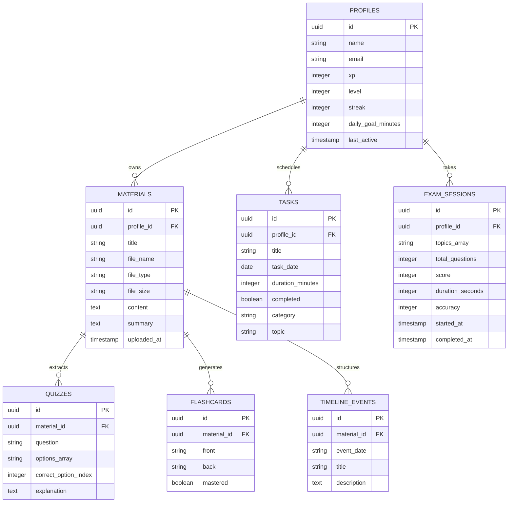

# Entity Relationship Diagram (ERD)

This schema represents the database architecture of Academy OS Ω.

```mermaid
erDiagram
    PROFILES ||--o{ MATERIALS : owns
    PROFILES ||--o{ TASKS : schedules
    PROFILES ||--o{ EXAM_SESSIONS : takes
    MATERIALS ||--o{ QUIZZES : extracts
    MATERIALS ||--o{ FLASHCARDS : generates
    MATERIALS ||--o{ TIMELINE_EVENTS : structures

    PROFILES {
        uuid id PK
        string name
        string email
        integer xp
        integer level
        integer streak
        integer daily_goal_minutes
        timestamp last_active
    }

    MATERIALS {
        uuid id PK
        uuid profile_id FK
        string title
        string file_name
        string file_type
        string file_size
        text content
        text summary
        timestamp uploaded_at
    }

    QUIZZES {
        uuid id PK
        uuid material_id FK
        string question
        string options_array
        integer correct_option_index
        text explanation
    }

    FLASHCARDS {
        uuid id PK
        uuid material_id FK
        string front
        string back
        boolean mastered
    }

    TIMELINE_EVENTS {
        uuid id PK
        uuid material_id FK
        string event_date
        string title
        text description
    }

    TASKS {
        uuid id PK
        uuid profile_id FK
        string title
        date task_date
        integer duration_minutes
        boolean completed
        string category
        string topic
    }

    EXAM_SESSIONS {
        uuid id PK
        uuid profile_id FK
        string topics_array
        integer total_questions
        integer score
        integer duration_seconds
        integer accuracy
        timestamp started_at
        timestamp completed_at
    }
```
